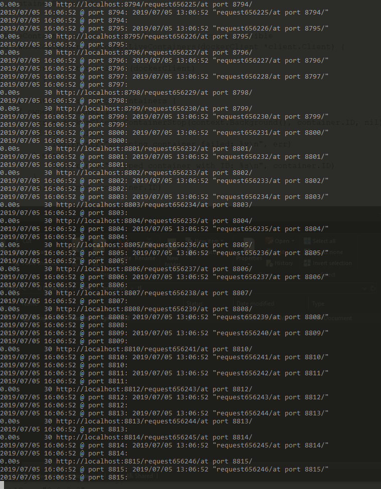

# Docker exercise response #
### by Mario Karagiorgas ### 
salem@gmail.com

6936640563

Tool for meeting these requirements:

* Create a **lean** Docker Image from the *Dockefile* in this repo.

* To launch this simple http://github.com/nethatix/echopathws http listener that echoes back the requested url path i.e., localhost:8770/1/2/3/ -> 1/2/3/.

* Supporting a scalable number of live containers creation. 

* Supporting liveness both as an app and through few unit tests.

* Consuming the Docker statistics streams for each live container. Optional persistence to an aggregated text file separate from the logs.

* Displaying and aggregating all the logging input streams of the live containers similarly to the statistics streams.

### Deliverable ###

This is a basic statically configured command line application that is efficient and scalable.

### Testing ### 

For this type of tooling, I focused on scalability, stability, and streaming logging correctness rather than micro validating (which is also valuable) lesser tracteristics. 

This *workflow/workflow_test.go->Test_Continuous_Logs_Http_Requests_100_Containers* requires a large timeout to as the 30 seconds are not even sufficient to launch 100 instances (could be a thousand in my old windows machine) totaling I/O 200 reader streams, a rapid fire httpGet requester and 4 ouputs (stdout, stderr, log, statsfile). I left it there waiting to crash... but it didn't :)
e.g., Υου may run it go test -run Test_Continuous_Logs_Http_Requests_100_Containers -timeout 100000s

##### Workflow Unit tests #####

within *github.com/nethatix/tlex/workflow$*

go test -run Test_Workflow_0_Containers

go test -run Test_Workflow_3_Containers_No_Stats

go test -run Test_Workflow_1_Containers

go test -run Test_Workflow_5_Containers

go test -run Test_Workflow_20_Containers -timeout 50s

go test -run Test_Continuous_Logs_Http_Requests_100_Containers -timeout 100000s

#### Tests harnesses ####

    workflow/           // the unit tests root folder.

    workflow/testdata/Dockerfile // the unit tests Dockerfile

    workflow/testdata/logFile.log // the unit tests log file. 

    workflow/testdata/StatsLogFile.log // the stats unit tests file.
    
    logger/logger_test.go   // simple test case
    
    dockerapi/ // has no test file but a few logic assert functions in .dockerapi/dockerapi.go employed at runtime

    - - - -

##### Windows getting along with 100 docker containers just fine! #####

### Installation ###

Preferably within **$gopath\src**

`git clone https://github.com/nethatix/tlex`

`cd tlex`

`./install.sh` (tested with windows bash) or `install.cmd` (windows)

Note the application builds and runs both *on* and *off* the **gopath** within the root *tlex* folder:
These commands worked in both locations on/off gopath locations:

`go build ./...` 

`go vet`

`go` `build` `-race` producing `tlex` or `tlex.exe` executables....

`go run tlex`

If you need any help to evaluate this or questions, please do not hesitate to contact me. I can package this with any older dependency managers of your preference.

### Interesting Paths & Files ###

    Dockerfile // (The employed docker image spec in root folder. )

    logFile.log        // is the application log file.

    StatsLogFile.log   // is the application stats file.

#### The Containerized Simple Echo Path HTTP Server ####

https://github.com/nethatix/echopathws // public repo.

If you need any help to evaluate this or have questions, please do not hesitate to contact me. I could also package this with any gopath dependency managers of your preference.